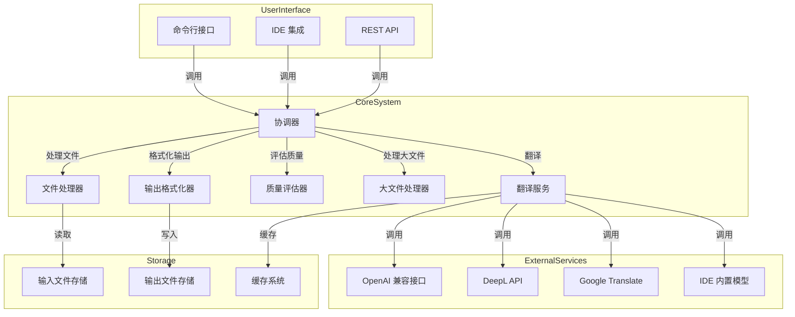
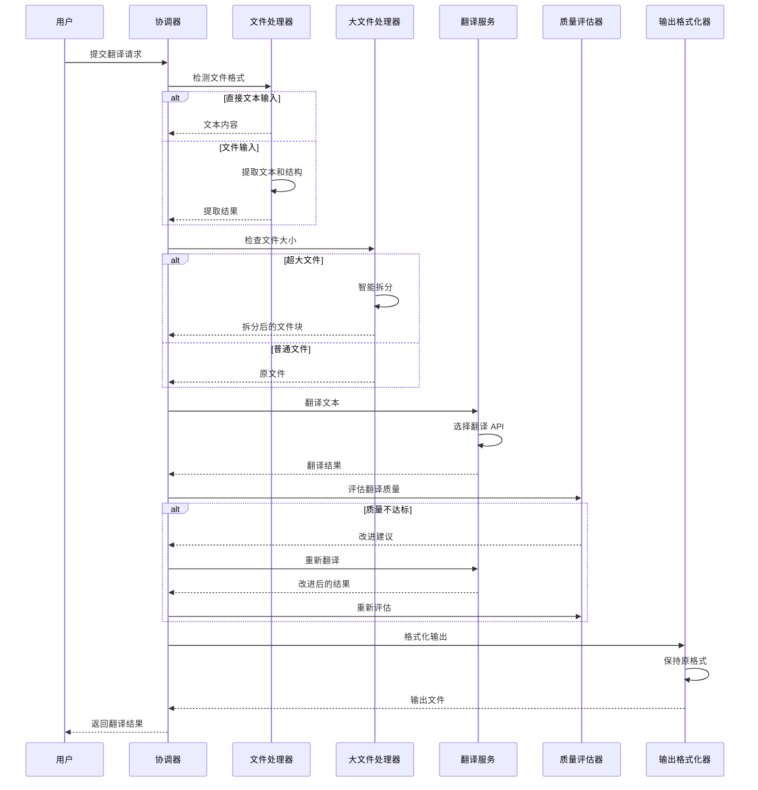
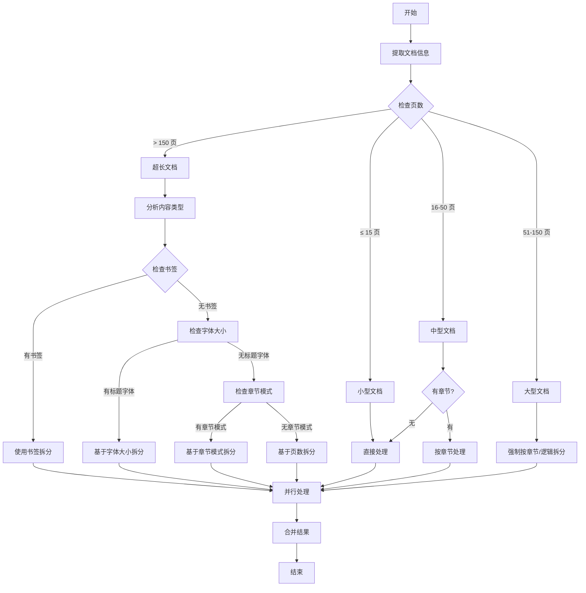
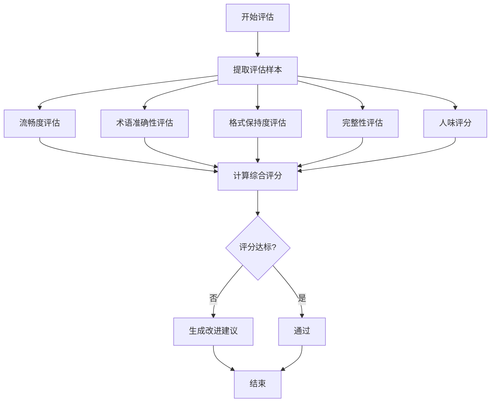
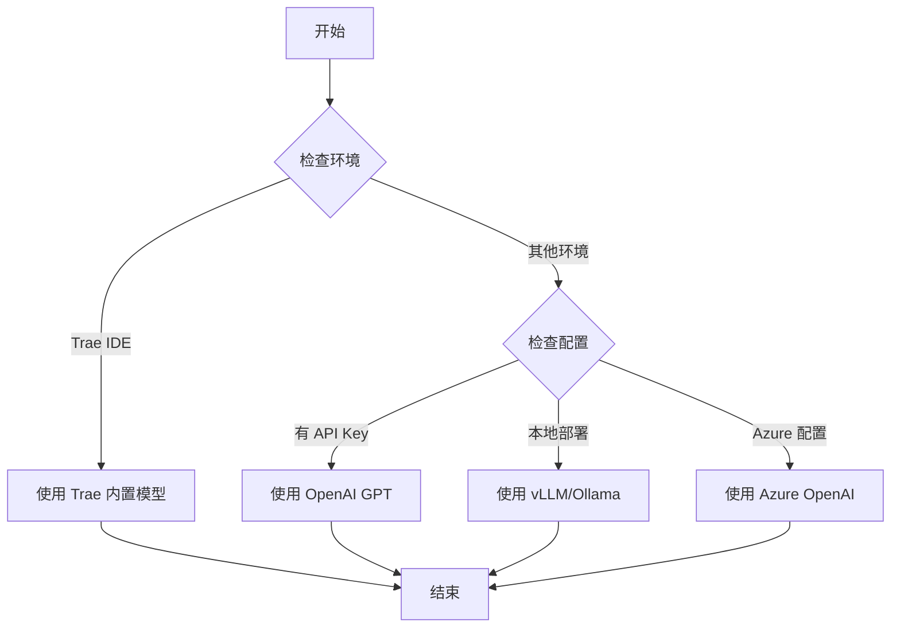

# 文档翻译系统架构设计

## MVP 阶段说明

本文档描述的是文档翻译系统的完整架构设计。在 MVP（最小可行产品）阶段，我们将实现以下核心功能：

### MVP 阶段功能范围

| 功能模块 | MVP 阶段 | 未来扩展 |
|----------|----------|----------|
| **翻译服务** | ✅ OpenAI 兼容接口 + IDE 内置模型（Trae） | DeepL、Google Translate、其他 IDE |
| **文件格式** | ✅ PDF、TXT、MD、DOCX、EPUB | 其他格式 |
| **大文件处理** | ✅ 智能拆分、并行处理 | 更复杂的拆分策略 |
| **翻译质量评估** | ❌ 暂不支持 | AI 评估 + 规则检查 |
| **迭代改进** | ❌ 暂不支持 | 自动改进机制 |
| **缓存机制** | ✅ 基础缓存 | 高级缓存策略 |

### MVP 阶段目标

1. **核心翻译功能**：支持多种文件格式的翻译
2. **OpenAI 兼容接口**：支持 OpenAI GPT、Azure OpenAI、vLLM、Ollama 等
3. **IDE 内置模型（Trae）**：利用 Trae IDE 自动选择模型（GLM-5、qwen3.5 plus、豆包 seed2、MinimaxM2.7 等），免费且集成度高
4. **大文件处理**：智能拆分和并行处理
5. **基础输出**：支持 PDF、DOCX、Markdown 输出

### 未来扩展功能

以下功能将在后续版本中实现：
- 翻译质量评估系统
- 迭代改进机制
- 多翻译 API 支持（DeepL、Google Translate）
- 专业术语库
- 翻译记忆库

## 1. 系统架构概览

### 1.1 整体架构



### 1.2 核心组件

| 组件 | 职责 | 关键功能 |
|------|------|----------|
| **协调器 (Coordinator)** | 系统核心，协调各组件工作 | 任务调度、状态管理、异常处理 |
| **文件处理器 (FileProcessor)** | 处理各种格式文件 | 格式识别、文本提取、结构解析 |
| **翻译服务 (Translator)** | 负责文本翻译 | 多 API 集成、上下文管理、术语处理 |
| **质量评估器 (QualityEvaluator)** | 评估翻译质量 | 多维度评分、改进建议生成 |
| **大文件处理器 (LargeFileHandler)** | 处理超大文件 | 智能拆分、并行处理、进度跟踪 |
| **输出格式化器 (OutputFormatter)** | 生成输出文件 | 格式保持、多格式输出、双语对照 |
| **缓存系统 (Cache)** | 缓存翻译结果 | 重复内容缓存、术语缓存 |

## 2. 数据流程和文件处理

### 2.1 文件处理流程



### 2.2 支持的文件格式

| 格式 | 输入支持 | 输出支持 | 处理库 |
|------|----------|----------|--------|
| TXT | ✅ | ✅ | 内置 |
| MD | ✅ | ✅ | 内置 |
| PDF | ✅ | ✅ | pdfplumber + pypdf |
| DOCX | ✅ | ✅ | python-docx |
| EPUB | ✅ | ❌ | ebooklib |
| 直接文本 | ✅ | ❌ | 内置 |

### 2.3 TXT 和直接输入文字的处理

#### 2.3.1 页数估算方法

| 语言类型 | 每页估算字数 | 说明 |
|----------|-------------|------|
| **中文** | 500 字/页 | 中文文字密度较高 |
| **英文** | 250 词/页 | 英文单词长度较长 |
| **混合语言** | 取平均值 | 根据实际比例调整 |

#### 2.3.2 判定流程

1. **计算文字数量**：统计中文字符数或英文单词数
2. **估算页数**：文字数量 ÷ 每页估算字数，结果向上取整
3. **应用判定标准**：使用与其他格式相同的页数阈值

#### 2.3.3 特殊情况处理

- **非常短的文本**（少于 100 字）：视为小型文档，直接处理
- **长文本输入**（超过 7500 字）：自动拆分处理
- **格式复杂的 TXT**：包含大量空行、列表、代码块时，适当增加页数估算

#### 2.3.4 实现示例

```python
def estimate_pages(text, language='auto'):
    """估算文本页数"""
    if language == 'auto':
        # 自动检测语言
        if any('\u4e00' <= c <= '\u9fff' for c in text):
            language = 'zh'
        else:
            language = 'en'
    
    if language == 'zh':
        # 中文：500字/页
        char_count = len([c for c in text if '\u4e00' <= c <= '\u9fff' or c in '，。！？；：""''（）【】'])
        pages = math.ceil(char_count / 500)
    else:
        # 英文：250词/页
        words = text.split()
        word_count = len(words)
        pages = math.ceil(word_count / 250)
    
    return pages

def classify_document(text, language='auto'):
    """分类文档类型"""
    pages = estimate_pages(text, language)
    
    if pages <= 15:
        return '小型文档'
    elif 16 <= pages <= 50:
        return '中型文档'
    elif 51 <= pages <= 150:
        return '大型文档'
    else:
        return '超长文档'
```

### 2.4 Markdown 文件的处理

#### 2.4.1 Markdown 与纯文本的区别

Markdown 文件虽然本质上也是文本文件，但具有以下特殊性：

1. **格式标记**：包含标题（#）、列表（-、*）、代码块（```）等格式标记
2. **代码块**：代码块通常占用较多空间，但实际信息密度较低
3. **图片标记**：`` 格式的图片标记需要特殊处理
4. **链接和引用**：`[]()` 格式的链接和引用标记

#### 2.4.2 页数估算调整

对于 Markdown 文件，需要调整页数估算方法：

1. **去除格式标记**：统计纯文本内容，去除 Markdown 语法标记
2. **代码块处理**：代码块按实际行数计算，但降低信息密度权重
3. **图片标记处理**：图片标记不计入字数，但计入内容复杂度

#### 2.4.3 实现示例

```python
import re

def estimate_markdown_pages(text, language='auto'):
    """估算 Markdown 文件页数"""
    
    # 去除代码块（代码块通常信息密度较低）
    text_without_code = re.sub(r'```[\s\S]*?```', '', text)
    
    # 去除图片标记
    text_without_images = re.sub(r'!\[.*?\]\(.*?\)', '', text_without_code)
    
    # 去除链接标记（保留链接文本）
    text_clean = re.sub(r'\[([^\]]+)\]\([^\)]+\)', r'\1', text_without_images)
    
    # 去除标题标记
    text_clean = re.sub(r'^#+\s+', '', text_clean, flags=re.MULTILINE)
    
    # 去除列表标记
    text_clean = re.sub(r'^[\*\-\+]\s+', '', text_clean, flags=re.MULTILINE)
    
    # 使用纯文本的页数估算方法
    return estimate_pages(text_clean, language)
```

#### 2.4.4 Markdown 文件类型系数

| Markdown 类型 | 复杂度系数 | 说明 |
|---------------|------------|------|
| 纯文本 Markdown | 1.0 | 主要是文本内容，少量格式标记 |
| 技术文档 Markdown | 1.3 | 包含代码块、表格、公式等 |
| 混合内容 Markdown | 1.5 | 包含大量图片、链接、引用等 |

## 3. 大文件处理和智能拆分

### 3.1 智能拆分策略



### 3.2 拆分阈值和策略

| 文档类型 | 页数范围 | 拆分策略 | 适用场景 |
|----------|----------|----------|----------|
| **小型文档** | ≤ 15 页 | 不拆分，直接处理 | 短文档，大模型翻译效果最佳 |
| **中型文档** | 16-50 页 | 按章节拆分（如果有） | 中等长度文档 |
| **大型文档** | 51-150 页 | 强制按章节/逻辑拆分 | 较长文档 |
| **超长文档** | > 150 页 | 智能多策略拆分 + 并行处理 | 书籍、大型手册 |

### 3.3 内容类型拆分调整

| 内容类型 | 建议拆分大小 | 理由 |
|----------|--------------|------|
| **纯文本** | 15-30 页/块 | 处理速度快，可较大块拆分 |
| **混合内容** | 10-20 页/块 | 包含少量图片，适中拆分 |
| **图片密集** | 5-15 页/块 | 图片处理耗时，需要较小块拆分 |

### 3.4 大模型翻译优化

根据实际运行效果，PDF A4 大小的纯文字文档，15页左右大模型翻译效果更好。因此：

- **最佳翻译单元**：15页以内的文档块
- **强制拆分点**：超过15页的文档自动拆分
- **上下文保持**：拆分时保持章节完整性，确保翻译上下文连贯

### 3.5 智能拆分策略

| 策略 | 描述 | 适用场景 |
|------|------|----------|
| **书签拆分** | 基于 PDF 内置书签（大纲）拆分 | 结构化文档，如书籍、手册 |
| **字体大小拆分** | 基于标题字体大小差异拆分 | 无书签但有清晰标题的文档 |
| **章节模式拆分** | 基于章节模式（如"第X章"）拆分 | 有标准章节格式的文档 |
| **页数拆分** | 基于固定页数拆分（默认 15 页） | 无明显结构的文档 |

### 3.6 并行处理

- **轻量级任务队列**：使用 Python 内置的 `asyncio` 和 `ThreadPoolExecutor` 管理翻译任务
- **并行度控制**：根据系统资源和 API 限流自动调整并行度
- **进度跟踪**：实时监控各文件块的翻译进度
- **错误恢复**：单个文件块失败不影响整体流程

## 4. 翻译质量评估系统（未来扩展）

> **注意**：翻译质量评估系统将在后续版本中实现，不在 MVP 阶段范围内。

### 4.1 评估维度

| 维度 | 权重 | 评估方法 |
|------|------|----------|
| **流畅度** | 30% | 使用语言模型评估语句通顺度 |
| **术语准确性** | 25% | 专业术语对照检查 |
| **格式保持度** | 20% | 对比原文和译文格式差异 |
| **完整性** | 15% | 检查段落、句子数量一致性 |
| **人味评分** | 10% | 评估译文自然度，避免机器感 |

### 4.2 评估流程



### 4.3 改进机制

- **自动改进**：基于评估结果自动生成改进提示
- **迭代次数**：最多 3 次迭代，避免无限循环
- **人工审核**：提供人工审核选项，特别适合专业文档

## 5. 多翻译 API 集成

> **MVP 阶段说明**：在 MVP 阶段，系统只支持 OpenAI 兼容接口。其他翻译服务（DeepL、Google Translate、IDE 内置模型）将在后续版本中实现。

### 5.1 支持的翻译服务

| 服务 | 类型 | MVP 阶段 | 优势 | 限制 |
|------|------|----------|------|------|
| OpenAI GPT | OpenAI 兼容 | ✅ 支持 | 上下文理解强，适合技术文档 | 成本较高 |
| Azure OpenAI | OpenAI 兼容 | ✅ 支持 | 企业级支持，安全性高 | 配置复杂 |
| vLLM | OpenAI 兼容 | ✅ 支持 | 本地部署，速度快 | 需要硬件资源 |
| Ollama | OpenAI 兼容 | ✅ 支持 | 轻量级本地部署 | 模型性能有限 |
| IDE 内置模型（Trae） | AI IDE Agent | ✅ 支持（仅 Trae） | 免费，自动选择模型（GLM-5、qwen3.5 plus、豆包 seed2、MinimaxM2.7 等），集成度高 | 暂时只支持 Trae IDE |
| DeepL | 专业翻译 | ❌ 未来扩展 | 翻译质量高，特别是欧洲语言 | API 成本高 |
| Google Translate | 通用翻译 | ❌ 未来扩展 | 支持语言多，成本适中 | 技术文档质量一般 |

### 5.2 API 选择策略（MVP 阶段）

在 MVP 阶段，系统支持 OpenAI 兼容接口和 IDE 内置模型（Trae），选择策略如下：



**选择优先级**：
1. **Trae IDE 环境**：优先使用 Trae 内置模型（免费、自动选择模型）
2. **其他环境**：根据配置选择 OpenAI 兼容接口
   - 有 API Key：使用 OpenAI GPT
   - 本地部署：使用 vLLM/Ollama
   - Azure 配置：使用 Azure OpenAI

### 5.3 故障转移机制（MVP 阶段）

在 MVP 阶段，故障转移机制简化为：

- **重试策略**：针对临时失败实现指数退避重试
- **配置切换**：手动切换不同的 OpenAI 兼容服务（OpenAI GPT ↔ Azure OpenAI ↔ vLLM/Ollama）
- **Trae IDE 降级**：当 Trae IDE 内置模型不可用时，提示用户配置 OpenAI 兼容接口

### 5.4 未来扩展：多 API 支持

在后续版本中，将实现以下功能：

- **API 健康检查**：定期检查各 API 可用性
- **自动故障转移**：当主 API 失败时自动切换到备用 API
- **智能选择**：根据文件大小、质量要求、成本考虑自动选择最佳 API

## 6. 系统扩展性和性能优化

### 6.1 扩展性设计

- **模块化架构**：各组件独立，便于扩展
- **插件系统**：支持自定义文件格式和翻译服务
- **配置驱动**：通过配置文件管理系统行为
- **容器化部署**：支持 Docker 容器化，便于横向扩展

### 6.2 性能优化

| 优化策略 | 实现方式 | 预期效果 |
|----------|----------|----------|
| **缓存机制** | 翻译结果缓存、术语缓存 | 减少重复翻译，提高速度 |
| **流式处理** | 大文件分块处理，边处理边输出 | 降低内存使用，提高响应速度 |
| **并行处理** | 多线程/多进程并行翻译 | 充分利用系统资源 |
| **异步操作** | 非阻塞 I/O，异步 API 调用 | 提高系统吞吐量 |
| **批量处理** | 合并小文件翻译请求 | 减少 API 调用次数 |
| **智能文档分析** | 增量分析文档复杂度，避免完整扫描 | 快速判定文档类型，提高启动速度 |
| **自适应拆分** | 根据内容类型自动调整拆分大小 | 优化资源分配，提高处理效率 |

### 6.3 监控和日志（适合 IDE Skill）

> **注意**：对于 IDE Skill，不需要复杂的监控系统（如 Prometheus、Grafana）。我们使用轻量级的日志和性能统计方案。

#### 6.3.1 日志系统

使用 `structlog` 实现结构化日志：

```python
import structlog

logger = structlog.get_logger()

# 记录翻译任务
logger.info("translation_started", 
            file="example.pdf", 
            pages=100, 
            target_language="zh")

# 记录性能指标
logger.info("translation_completed", 
            duration_seconds=120.5, 
            pages_translated=100,
            api_calls=10)
```

#### 6.3.2 性能统计

使用简单的性能统计，记录关键指标：

```python
import time
from dataclasses import dataclass
from typing import Dict, List

@dataclass
class PerformanceMetrics:
    """性能指标"""
    total_translations: int = 0
    total_pages: int = 0
    total_duration: float = 0.0
    api_calls: int = 0
    errors: int = 0
    
    def add_translation(self, pages: int, duration: float, api_calls: int):
        self.total_translations += 1
        self.total_pages += pages
        self.total_duration += duration
        self.api_calls += api_calls
    
    def get_average_speed(self) -> float:
        """获取平均翻译速度（页/分钟）"""
        if self.total_duration == 0:
            return 0
        return (self.total_pages / self.total_duration) * 60

# 全局性能指标
metrics = PerformanceMetrics()
```

#### 6.3.3 文件日志

将日志写入文件，便于调试：

```python
import logging
from pathlib import Path

def setup_file_logging(log_dir: str = "logs"):
    """设置文件日志"""
    log_path = Path(log_dir)
    log_path.mkdir(exist_ok=True)
    
    logging.basicConfig(
        level=logging.INFO,
        format='%(asctime)s - %(name)s - %(levelname)s - %(message)s',
        handlers=[
            logging.FileHandler(log_path / 'translator.log'),
            logging.StreamHandler()  # 同时输出到控制台
        ]
    )
```

#### 6.3.4 监控指标

记录关键监控指标：

- **性能监控**：翻译时间、平均速度、API 调用次数
- **错误日志**：详细记录系统错误和异常
- **资源使用**：内存使用、CPU 使用（可选）
- **文档分析**：文档分析时间、拆分策略

#### 6.3.5 为什么不适合 Prometheus/Grafana

| 问题 | 说明 |
|------|------|
| **部署复杂** | 需要独立部署 Prometheus 服务器和 Grafana 服务 |
| **资源消耗** | 占用额外的系统资源，影响 IDE 性能 |
| **过度设计** | 对于单用户 IDE Skill 来说过于重量级 |
| **维护成本** | 需要额外的配置和维护 |
| **用户体验** | 用户需要额外安装和配置这些服务 |

#### 6.3.6 轻量级方案的优势

| 优势 | 说明 |
|------|------|
| **无外部依赖** | 纯 Python 实现，无需额外服务 |
| **轻量级** | 资源消耗低，不影响 IDE 性能 |
| **易于调试** | 日志文件便于查看和分析 |
| **跨平台** | 在所有支持 Python 的环境中均可运行 |
| **用户友好** | 无需额外配置，开箱即用 |

## 7. 技术栈选择

| 类别 | 技术 | 版本 | 选择理由 |
|------|------|------|----------|
| **核心语言** | Python | 3.8+ | 丰富的文档处理库，易于集成 AI 模型 |
| **PDF 处理** | pdfplumber, pypdf | 0.11.9, 3.0+ | 文本提取质量高，支持大文件处理 |
| **DOCX 处理** | python-docx | 0.8.11+ | 成熟的 DOCX 处理库 |
| **EPUB 处理** | ebooklib | 0.17.1+ | 支持 EPUB 格式解析 |
| **并行处理** | asyncio, ThreadPoolExecutor | 内置 | 轻量级并行处理，无外部依赖 |
| **缓存** | functools.lru_cache, pickle | 内置 | 轻量级内存缓存 |
| **API 集成** | requests | 2.31+ | 简洁的 HTTP 客户端 |
| **配置管理** | pydantic | 2.0+ | 类型安全的配置管理 |
| **日志** | structlog | 23.3+ | 结构化日志，便于分析 |
| **监控** | structlog, 文件日志 | 内置 | 轻量级日志和性能统计，无需额外服务 |

## 8. 部署和集成方案

### 8.1 部署选项

| 部署方式 | 适用场景 | 优势 |
|----------|----------|------|
| **本地部署** | 开发环境，个人使用 | 配置简单，无网络依赖 |
| **Docker 容器** | 团队环境，持续集成 | 环境隔离，部署一致 |
| **云服务** | 生产环境，高可用性 | 可扩展性强，可靠性高 |

### 8.2 IDE 集成

- **VS Code 插件**：通过 VS Code 扩展集成
- **JetBrains 插件**：支持 IntelliJ, PyCharm 等
- **命令行工具**：提供 CLI 接口，支持脚本调用
- **API 接口**：提供 REST API，支持第三方集成

## 9. 安全考虑

### 9.1 数据安全

- **本地处理**：敏感文档优先使用 IDE 内置模型，保护隐私
- **数据加密**：传输和存储加密
- **隐私保护**：不存储用户文档内容
- **访问控制**：基于角色的访问控制

### 9.2 API 安全

- **API 密钥管理**：安全存储 API 密钥
- **请求限流**：防止 API 滥用
- **输入验证**：防止注入攻击
- **输出 sanitization**：防止 XSS 攻击

## 10. 未来扩展

### 10.1 计划中的功能

- **专业术语库**：支持自定义术语库
- **翻译记忆库**：积累翻译经验，提高一致性
- **实时翻译**：支持文档实时翻译
- **多语言对比**：支持多语言对照输出
- **协作翻译**：支持多人协作翻译

### 10.2 技术演进

- **模型优化**：使用更先进的翻译模型
- **自动学习**：从用户反馈中学习，不断改进
- **多模态支持**：支持图像、表格等非文本内容翻译
- **边缘计算**：支持边缘设备部署，提高响应速度

## 11. 结论

本文档设计了一个完整的文档翻译系统架构，支持多种文件格式和大文件处理。系统采用模块化设计，具有良好的扩展性和性能。通过智能拆分、并行处理、多 API 集成和质量评估机制，系统能够高效处理各种翻译任务，提供高质量的翻译结果。

该架构不仅满足当前需求，还为未来的功能扩展和技术演进预留了空间。系统可以根据实际使用场景进行调整和优化，以达到最佳的性能和用户体验。
