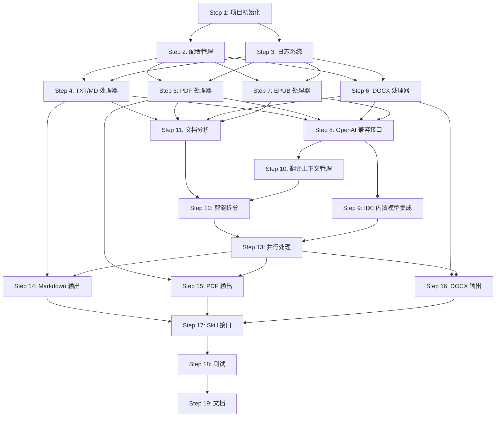

# Any File Translator - 构建计划

## 项目概述

**目标**: 构建一个多格式文件翻译 Skill，支持 PDF、TXT、MD、DOCX、EPUB 等格式，能够智能处理超大文件（1000-2000 页），并提供基于 AI 的翻译质量评估和迭代改进机制。

**MVP 范围**: OpenAI 兼容接口 + IDE 内置模型（Trae），基础缓存，智能拆分和并行处理。

**技术栈**: Python 3.8+, pdfplumber, pypdf, python-docx, ebooklib, asyncio, ThreadPoolExecutor, structlog

**模式**: 直接模式（无 git/gh，edit-in-place）

---

## 依赖图



---

## 并行性分析

### 可并行执行的步骤

| 步骤组 | 步骤 | 理由 |
|--------|------|------|
| **文件处理器组** | Step 4, 5, 6, 7 | 无文件依赖，共享配置和日志接口 |
| **输出格式化器组** | Step 14, 15, 16 | 无文件依赖，共享翻译结果接口 |

### 必须串行执行的步骤

| 步骤 | 理由 |
|------|------|
| Step 1 → Step 2, 3 | 项目初始化必须先于配置和日志 |
| Step 2, 3 → Step 4-7 | 文件处理器依赖配置和日志 |
| Step 4-7 → Step 8 | 翻译引擎依赖文件处理器 |
| Step 8 → Step 9, 10 | IDE 集成和上下文管理依赖翻译引擎 |
| Step 11-13 → Step 14-16 | 输出格式化器依赖大文件处理 |
| Step 14-16 → Step 17 | Skill 接口依赖输出格式化器 |
| Step 17 → Step 18, 19 | 测试和文档依赖完整实现 |

---

## 步骤详情

### Phase 1: 核心基础设施

#### Step 1: 项目初始化和依赖管理

**上下文简报**:
创建项目的基础结构，包括目录结构、依赖管理文件（requirements.txt 或 pyproject.toml）、基础配置文件。这是整个项目的基础，后续所有步骤都依赖于此步骤。

**任务列表**:
- [ ] 创建项目目录结构（src/, tests/, docs/, data/, output/, examples/）
- [ ] 创建测试数据目录（tests/data/），包含示例文件（TXT, MD, PDF, DOCX, EPUB）
- [ ] 创建 requirements.txt 或 pyproject.toml，包含核心依赖（pdfplumber, pypdf, python-docx, ebooklib, requests, pydantic, structlog）
- [ ] 创建 .gitignore 文件
- [ ] 创建 README.md，包含项目简介和快速开始指南
- [ ] 创建基础的项目配置文件（config.yaml 或 config.json）

**验证命令**:
```bash
# 验证目录结构
ls -la src/ tests/ docs/ data/ output/

# 验证依赖文件
cat requirements.txt

# 验证 README
head -20 README.md
```

**退出标准**:
- ✅ 所有目录已创建
- ✅ 依赖文件包含所有必需的库
- ✅ README.md 包含项目简介和快速开始指南
- ✅ .gitignore 包含常见的 Python 忽略项

**模型层级**: Default

**回滚策略**: 删除创建的目录和文件

---

#### Step 2: 配置管理系统

**上下文简报**:
实现配置管理系统，支持从文件（YAML/JSON）和环境变量加载配置。使用 pydantic 进行类型安全的配置验证。配置包括翻译 API 设置、文件处理参数、输出格式选项等。

**任务列表**:
- [ ] 创建 src/config/ 目录
- [ ] 实现 config.py，使用 pydantic 定义配置模型
- [ ] 实现配置加载器，支持从文件和环境变量加载
- [ ] 创建默认配置文件 config/default.yaml
- [ ] 编写单元测试 tests/test_config.py

**验证命令**:
```bash
# 运行配置测试
python -m pytest tests/test_config.py -v

# 验证配置加载
python -c "from src.config import load_config; print(load_config())"
```

**退出标准**:
- ✅ 配置模型使用 pydantic 定义
- ✅ 支持从 YAML 文件和环境变量加载配置
- ✅ 所有配置测试通过
- ✅ 默认配置文件包含所有必需的配置项

**模型层级**: Default

**回滚策略**: 删除 src/config/ 目录和测试文件

---

#### Step 3: 日志和错误处理系统

**上下文简报**:
实现日志系统，使用 structlog 进行结构化日志记录。实现统一的错误处理机制，定义自定义异常类。日志系统支持文件输出和控制台输出，错误处理包括重试机制和错误报告。

**任务列表**:
- [ ] 创建 src/utils/ 目录
- [ ] 实现 logger.py，使用 structlog 配置日志系统
- [ ] 实现 exceptions.py，定义自定义异常类（TranslationError, FileProcessingError, APIError 等）
- [ ] 实现 error_handler.py，实现错误处理和重试机制
- [ ] 编写单元测试 tests/test_logger.py 和 tests/test_exceptions.py

**验证命令**:
```bash
# 运行日志测试
python -m pytest tests/test_logger.py -v

# 运行异常测试
python -m pytest tests/test_exceptions.py -v

# 验证日志输出
python -c "from src.utils.logger import get_logger; logger = get_logger(); logger.info('test')"
```

**退出标准**:
- ✅ 日志系统使用 structlog 实现
- ✅ 支持文件和控制台输出
- ✅ 自定义异常类已定义
- ✅ 错误处理和重试机制已实现
- ✅ 所有测试通过

**模型层级**: Default

**回滚策略**: 删除 src/utils/ 目录和测试文件

---

### Phase 2: 文件处理层

#### Step 4: TXT/MD 文件处理器

**上下文简报**:
实现 TXT 和 Markdown 文件处理器，支持文本提取、页数估算、格式保持。TXT 处理器直接读取文本内容，MD 处理器需要去除格式标记并估算页数。

**任务列表**:
- [ ] 创建 src/parsers/ 目录
- [ ] 实现 base_parser.py，定义基础解析器接口
- [ ] 实现 txt_parser.py，实现 TXT 文件解析
- [ ] 实现 md_parser.py，实现 Markdown 文件解析（去除格式标记、估算页数）
- [ ] 编写单元测试 tests/parsers/test_txt_parser.py 和 tests/parsers/test_md_parser.py

**验证命令**:
```bash
# 运行解析器测试
python -m pytest tests/parsers/ -v

# 验证 TXT 解析
python -c "from src.parsers.txt_parser import TXTParser; parser = TXTParser(); print(parser.parse('test.txt'))"

# 验证 MD 解析
python -c "from src.parsers.md_parser import MDParser; parser = MDParser(); print(parser.parse('test.md'))"
```

**退出标准**:
- ✅ 基础解析器接口已定义
- ✅ TXT 解析器支持文本提取和页数估算
- ✅ MD 解析器支持格式标记去除和页数估算
- ✅ 所有测试通过

**模型层级**: Default

**回滚策略**: 删除 src/parsers/ 目录和测试文件

---

#### Step 5: PDF 文件处理器

**上下文简报**:
实现 PDF 文件处理器，使用 pdfplumber 和 pypdf 进行文本提取、页数获取、书签解析。支持文本 PDF 和扫描 PDF 的检测。

**任务列表**:
- [ ] 实现 pdf_parser.py，使用 pdfplumber 提取文本
- [ ] 实现页数获取功能
- [ ] 实现书签解析功能（用于智能拆分）
- [ ] 实现图片检测功能（判断是否为扫描 PDF）
- [ ] 编写单元测试 tests/parsers/test_pdf_parser.py

**验证命令**:
```bash
# 运行 PDF 解析器测试
python -m pytest tests/parsers/test_pdf_parser.py -v

# 验证 PDF 解析
python -c "from src.parsers.pdf_parser import PDFParser; parser = PDFParser(); print(parser.parse('test.pdf'))"
```

**退出标准**:
- ✅ PDF 解析器支持文本提取
- ✅ 支持页数获取和书签解析
- ✅ 支持图片检测
- ✅ 所有测试通过

**模型层级**: Default

**回滚策略**: 删除 pdf_parser.py 和测试文件

---

#### Step 6: DOCX 文件处理器

**上下文简报**:
实现 DOCX 文件处理器，使用 python-docx 进行文本提取、段落解析、图片检测。支持格式保持和页数估算。

**任务列表**:
- [ ] 实现 docx_parser.py，使用 python-docx 提取文本
- [ ] 实现段落解析功能
- [ ] 实现图片检测功能
- [ ] 实现页数估算功能
- [ ] 编写单元测试 tests/parsers/test_docx_parser.py

**验证命令**:
```bash
# 运行 DOCX 解析器测试
python -m pytest tests/parsers/test_docx_parser.py -v

# 验证 DOCX 解析
python -c "from src.parsers.docx_parser import DOCXParser; parser = DOCXParser(); print(parser.parse('test.docx'))"
```

**退出标准**:
- ✅ DOCX 解析器支持文本提取
- ✅ 支持段落解析和图片检测
- ✅ 支持页数估算
- ✅ 所有测试通过

**模型层级**: Default

**回滚策略**: 删除 docx_parser.py 和测试文件

---

#### Step 7: EPUB 文件处理器

**上下文简报**:
实现 EPUB 文件处理器，使用 ebooklib 进行文本提取、章节解析、图片检测。支持格式保持和页数估算。

**任务列表**:
- [ ] 实现 epub_parser.py，使用 ebooklib 提取文本
- [ ] 实现章节解析功能
- [ ] 实现图片检测功能
- [ ] 实现页数估算功能
- [ ] 编写单元测试 tests/parsers/test_epub_parser.py

**验证命令**:
```bash
# 运行 EPUB 解析器测试
python -m pytest tests/parsers/test_epub_parser.py -v

# 验证 EPUB 解析
python -c "from src.parsers.epub_parser import EPUBParser; parser = EPUBParser(); print(parser.parse('test.epub'))"
```

**退出标准**:
- ✅ EPUB 解析器支持文本提取
- ✅ 支持章节解析和图片检测
- ✅ 支持页数估算
- ✅ 所有测试通过

**模型层级**: Default

**回滚策略**: 删除 epub_parser.py 和测试文件

---

### Phase 3: 翻译引擎

#### Step 8: OpenAI 兼容接口集成

**上下文简报**:
实现 OpenAI 兼容接口集成，支持 OpenAI GPT、Azure OpenAI、vLLM、Ollama 等。使用 requests 库调用 API，支持流式响应和错误处理。

**任务列表**:
- [ ] 创建 src/translators/ 目录
- [ ] 实现 base_translator.py，定义基础翻译器接口
- [ ] 实现 openai_translator.py，实现 OpenAI 兼容接口调用
- [ ] 实现配置管理（API Key、Base URL、模型选择）
- [ ] 实现错误处理和重试机制
- [ ] 编写单元测试 tests/translators/test_openai_translator.py

**验证命令**:
```bash
# 运行翻译器测试
python -m pytest tests/translators/test_openai_translator.py -v

# 验证翻译功能
python -c "from src.translators.openai_translator import OpenAITranslator; t = OpenAITranslator(); print(t.translate('Hello', 'zh'))"
```

**退出标准**:
- ✅ 基础翻译器接口已定义
- ✅ OpenAI 兼容接口支持多种服务（OpenAI、Azure、vLLM、Ollama）
- ✅ 支持流式响应和错误处理
- ✅ 所有测试通过

**模型层级**: Strongest

**回滚策略**: 删除 src/translators/ 目录和测试文件

---

#### Step 9: IDE 内置模型（Trae）集成

**上下文简报**:
实现 IDE 内置模型（Trae）集成，利用 Trae IDE 自动选择模型（GLM-5、qwen3.5 plus、豆包 seed2、MinimaxM2.7 等）。需要检测 Trae IDE 环境，并调用其内置模型接口。

**前置条件**:
- Trae IDE 环境已安装并配置
- Trae IDE API 文档已查阅（参考 Trae IDE 官方文档）
- 了解 Trae IDE 的模型选择机制和 API 调用方式

**任务列表**:
- [ ] 实现 trae_translator.py，实现 Trae IDE 内置模型调用
- [ ] 实现环境检测功能（检测是否在 Trae IDE 中运行）
- [ ] 实现模型选择逻辑（自动选择或手动指定）
- [ ] 实现错误处理和降级策略
- [ ] 编写单元测试 tests/translators/test_trae_translator.py

**验证命令**:
```bash
# 运行 Trae 翻译器测试
python -m pytest tests/translators/test_trae_translator.py -v

# 验证 Trae 翻译功能
python -c "from src.translators.trae_translator import TraeTranslator; t = TraeTranslator(); print(t.translate('Hello', 'zh'))"
```

**退出标准**:
- ✅ Trae 翻译器支持环境检测
- ✅ 支持自动选择模型
- ✅ 支持错误处理和降级策略
- ✅ 所有测试通过

**模型层级**: Strongest

**回滚策略**: 删除 trae_translator.py 和测试文件

---

#### Step 10: 翻译上下文管理

**上下文简报**:
实现翻译上下文管理，支持长文本的分段翻译、上下文保持、术语一致性。使用缓存机制避免重复翻译。

**任务列表**:
- [ ] 实现 context_manager.py，管理翻译上下文
- [ ] 实现分段翻译逻辑
- [ ] 实现上下文保持机制
- [ ] 实现缓存机制（使用 functools.lru_cache）
- [ ] 编写单元测试 tests/test_context_manager.py

**验证命令**:
```bash
# 运行上下文管理测试
python -m pytest tests/test_context_manager.py -v

# 验证上下文管理
python -c "from src.translators.context_manager import ContextManager; cm = ContextManager(); print(cm.translate_long_text('Long text...', 'zh'))"
```

**退出标准**:
- ✅ 上下文管理器支持分段翻译
- ✅ 支持上下文保持
- ✅ 支持缓存机制
- ✅ 所有测试通过

**模型层级**: Default

**回滚策略**: 删除 context_manager.py 和测试文件

---

### Phase 4: 大文件处理

#### Step 11: 文档分析和页数估算

**上下文简报**:
实现文档分析功能，包括页数提取、内容类型分析、复杂度计算。支持多种文件格式的分析，为智能拆分提供依据。

**任务列表**:
- [ ] 创建 src/analyzer/ 目录
- [ ] 实现 document_analyzer.py，实现文档分析功能
- [ ] 实现页数提取功能（针对不同格式）
- [ ] 实现内容类型分析（文本 vs 图片占比）
- [ ] 实现复杂度计算（页数 × 文件类型系数 × 内容类型系数）
- [ ] 编写单元测试 tests/analyzer/test_document_analyzer.py

**验证命令**:
```bash
# 运行文档分析测试
python -m pytest tests/analyzer/test_document_analyzer.py -v

# 验证文档分析
python -c "from src.analyzer.document_analyzer import DocumentAnalyzer; da = DocumentAnalyzer(); print(da.analyze('test.pdf'))"
```

**退出标准**:
- ✅ 文档分析器支持多种格式
- ✅ 支持页数提取和内容类型分析
- ✅ 支持复杂度计算
- ✅ 所有测试通过

**模型层级**: Default

**回滚策略**: 删除 src/analyzer/ 目录和测试文件

---

#### Step 12: 智能拆分策略

**上下文简报**:
实现智能拆分策略，基于文档分析结果选择最佳拆分方法。支持书签拆分、字体大小拆分、章节模式拆分、页数拆分。

**任务列表**:
- [ ] 创建 src/chunker/ 目录
- [ ] 实现 base_chunker.py，定义基础拆分器接口
- [ ] 实现 bookmark_chunker.py，基于书签拆分
- [ ] 实现 pattern_chunker.py，基于章节模式拆分
- [ ] 实现 page_chunker.py，基于页数拆分
- [ ] 实现 smart_chunker.py，智能选择拆分策略
- [ ] 编写单元测试 tests/chunker/test_chunkers.py

**验证命令**:
```bash
# 运行拆分器测试
python -m pytest tests/chunker/test_chunkers.py -v

# 验证智能拆分
python -c "from src.chunker.smart_chunker import SmartChunker; sc = SmartChunker(); print(sc.chunk('test.pdf'))"
```

**退出标准**:
- ✅ 支持多种拆分策略
- ✅ 智能选择最佳拆分方法
- ✅ 所有测试通过

**模型层级**: Default

**回滚策略**: 删除 src/chunker/ 目录和测试文件

---

#### Step 13: 并行处理管理

**上下文简报**:
实现并行处理管理，使用 asyncio 和 ThreadPoolExecutor 进行并行翻译。支持并行度控制、进度跟踪、错误恢复。

**任务列表**:
- [ ] 创建 src/parallel/ 目录
- [ ] 实现 task_manager.py，管理并行任务
- [ ] 实现并行度动态调整功能
- [ ] 实现进度跟踪功能
- [ ] 实现错误恢复机制
- [ ] 编写单元测试 tests/parallel/test_task_manager.py

**验证命令**:
```bash
# 运行并行处理测试
python -m pytest tests/parallel/test_task_manager.py -v

# 验证并行处理
python -c "from src.parallel.task_manager import TaskManager; tm = TaskManager(); print(tm.run_parallel(['task1', 'task2']))"
```

**退出标准**:
- ✅ 任务管理器支持并行处理
- ✅ 支持并行度动态调整
- ✅ 支持进度跟踪和错误恢复
- ✅ 所有测试通过

**模型层级**: Default

**回滚策略**: 删除 src/parallel/ 目录和测试文件

---

### Phase 5: 输出层

#### Step 14: Markdown 输出格式化器

**上下文简报**:
实现 Markdown 输出格式化器，支持翻译结果的 Markdown 格式输出。支持双语对照、格式保持。

**任务列表**:
- [ ] 创建 src/formatters/ 目录
- [ ] 实现 base_formatter.py，定义基础格式化器接口
- [ ] 实现 md_formatter.py，实现 Markdown 输出
- [ ] 实现双语对照功能
- [ ] 编写单元测试 tests/formatters/test_md_formatter.py

**验证命令**:
```bash
# 运行格式化器测试
python -m pytest tests/formatters/test_md_formatter.py -v

# 验证 Markdown 输出
python -c "from src.formatters.md_formatter import MDFormatter; f = MDFormatter(); print(f.format('Translated text', 'Original text'))"
```

**退出标准**:
- ✅ Markdown 格式化器支持基本输出
- ✅ 支持双语对照
- ✅ 所有测试通过

**模型层级**: Default

**回滚策略**: 删除 src/formatters/ 目录和测试文件

---

#### Step 15: PDF 输出格式化器

**上下文简报**:
实现 PDF 输出格式化器，支持翻译结果的 PDF 格式输出。使用 pypdf 或 reportlab 生成 PDF，支持格式保持、双语对照。

**任务列表**:
- [ ] 实现 pdf_formatter.py，实现 PDF 输出
- [ ] 实现格式保持功能
- [ ] 实现双语对照功能
- [ ] 编写单元测试 tests/formatters/test_pdf_formatter.py

**验证命令**:
```bash
# 运行 PDF 格式化器测试
python -m pytest tests/formatters/test_pdf_formatter.py -v

# 验证 PDF 输出
python -c "from src.formatters.pdf_formatter import PDFFormatter; f = PDFFormatter(); print(f.format('Translated text', 'Original text'))"
```

**退出标准**:
- ✅ PDF 格式化器支持基本输出
- ✅ 支持格式保持和双语对照
- ✅ 所有测试通过

**模型层级**: Default

**回滚策略**: 删除 pdf_formatter.py 和测试文件

---

#### Step 16: DOCX 输出格式化器

**上下文简报**:
实现 DOCX 输出格式化器，支持翻译结果的 DOCX 格式输出。使用 python-docx 生成 DOCX，支持格式保持、双语对照。

**任务列表**:
- [ ] 实现 docx_formatter.py，实现 DOCX 输出
- [ ] 实现格式保持功能
- [ ] 实现双语对照功能
- [ ] 编写单元测试 tests/formatters/test_docx_formatter.py

**验证命令**:
```bash
# 运行 DOCX 格式化器测试
python -m pytest tests/formatters/test_docx_formatter.py -v

# 验证 DOCX 输出
python -c "from src.formatters.docx_formatter import DOCXFormatter; f = DOCXFormatter(); print(f.format('Translated text', 'Original text'))"
```

**退出标准**:
- ✅ DOCX 格式化器支持基本输出
- ✅ 支持格式保持和双语对照
- ✅ 所有测试通过

**模型层级**: Default

**回滚策略**: 删除 docx_formatter.py 和测试文件

---

### Phase 6: Skill 集成和测试

#### Step 17: Skill 接口实现

**上下文简报**:
实现 Skill 接口，集成所有组件，提供统一的翻译接口。支持文件输入、直接文本输入、多格式输出。

**任务列表**:
- [ ] 创建 SKILL.md，定义 Skill 接口和使用方法
- [ ] 实现 skill.py，集成所有组件
- [ ] 实现文件翻译接口
- [ ] 实现直接文本翻译接口
- [ ] 实现多格式输出接口
- [ ] 编写集成测试 tests/test_skill.py

**验证命令**:
```bash
# 运行 Skill 测试
python -m pytest tests/test_skill.py -v

# 验证 Skill 功能
python -c "from src.skill import translate_file; print(translate_file('test.pdf', 'zh', 'output.pdf'))"
```

**退出标准**:
- ✅ Skill 接口已定义
- ✅ 支持文件翻译和直接文本翻译
- ✅ 支持多格式输出
- ✅ 所有测试通过

**模型层级**: Strongest

**回滚策略**: 删除 SKILL.md, skill.py 和测试文件

---

#### Step 18: 单元测试和集成测试

**上下文简报**:
编写完整的单元测试和集成测试，确保所有组件正常工作。使用 pytest 进行测试，确保测试覆盖率 ≥80%。

**任务列表**:
- [ ] 编写所有模块的单元测试
- [ ] 编写集成测试（端到端测试）
- [ ] 配置 pytest 和测试覆盖率工具
- [ ] 确保测试覆盖率 ≥80%
- [ ] 创建测试数据（示例文件）

**验证命令**:
```bash
# 运行所有测试
python -m pytest tests/ -v --cov=src --cov-report=html

# 查看测试覆盖率
open htmlcov/index.html
```

**退出标准**:
- ✅ 所有单元测试通过
- ✅ 所有集成测试通过
- ✅ 测试覆盖率 ≥80%

**模型层级**: Default

**回滚策略**: 删除测试文件和测试数据

---

#### Step 19: 文档和示例

**上下文简报**:
编写完整的文档和示例，包括用户指南、API 文档、示例代码。确保用户能够快速上手使用 Skill。

**任务列表**:
- [ ] 更新 README.md，包含完整的安装和使用指南
- [ ] 编写用户指南 docs/user-guide.md
- [ ] 编写 API 文档 docs/api.md
- [ ] 创建示例代码 examples/
- [ ] 创建示例文件（测试用的 PDF、DOCX、EPUB 等）

**验证命令**:
```bash
# 验证文档完整性
ls -la docs/
ls -la examples/

# 验证示例代码
python examples/basic_translation.py
```

**退出标准**:
- ✅ README.md 包含完整的安装和使用指南
- ✅ 用户指南和 API 文档已完成
- ✅ 示例代码可运行
- ✅ 示例文件已创建

**模型层级**: Default

**回滚策略**: 删除文档和示例文件

---

## 总结

**总步骤数**: 19

**并行步骤组**: 2 组（文件处理器组、输出格式化器组）

**预计总时间**: 4-6 周（取决于团队规模和并行度）

**关键里程碑**:
- Phase 1 完成: 基础设施就绪
- Phase 2 完成: 文件处理能力就绪
- Phase 3 完成: 翻译引擎就绪
- Phase 4 完成: 大文件处理能力就绪
- Phase 5 完成: 输出能力就绪
- Phase 6 完成: Skill 可用

**风险和缓解**:
- **风险**: PDF 处理库可能不支持某些特殊格式
  - **缓解**: 提前测试各种 PDF 格式，准备备用方案
- **风险**: 翻译 API 限流可能影响大文件处理
  - **缓解**: 实现请求队列和重试机制
- **风险**: IDE 内置模型接口可能不稳定
  - **缓解**: 实现降级策略，切换到 OpenAI 兼容接口

**下一步**: 开始执行 Step 1（项目初始化和依赖管理）
